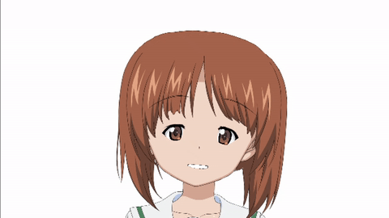

# Cartoon Avatar

Cartoon avatar rendering for video conferences

Inspired by [avatarify](https://github.com/alievk/avatarify)

  

## Installation

### Windows
  1. Install (dlib takes a while to build): `pip install -r requirements.txt`
  2. Download and unzip [facial landmark model](https://github.com/davisking/dlib-models/blob/master/shape_predictor_68_face_landmarks.dat.bz2) into `data` directory
  3. Install OBS
  4. Install OBS VirtualCam plugin
  
## Running with Virtual Webcam
  - `python app.py <avatar_path>`
  - Open OBS
    - Add a new `Window Capture` source linked to the output feed
    - Start VirtualCam under Tools -> VirtualCam
    - Adjust screen in OBS accordingly
  - Open Zoom
    - Set video source to `OBS Camera`
